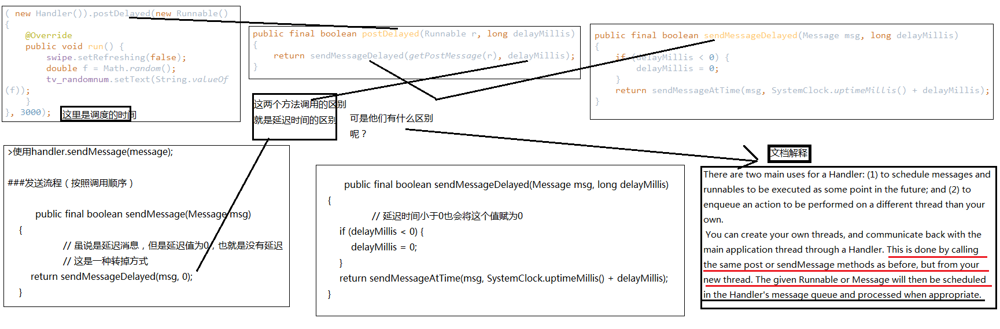

#Android消息机制Handler(二)
2015年8月1日13:13:10

##Handler两大使用方式
	1.调度messages和runnables，同时可以设置延迟调度时间（延迟加载）
	2.不同进程间的消息传递（子线程不可更新UI的解决方案）
文档描述：
>There are two main uses for a Handler: 
>
>(1) to schedule messages and runnables to be executed as some point in the future; and 
>
>(2) to enqueue an action to be performed on a different thread than your own.

>下面这段说明`post`和`sendMessage`两个方法是基本类似的
>
>You can create your own threads, and communicate back with the main application thread through a Handler. This is done by calling the same `post` or `sendMessage` methods as before, but from your new thread. The given Runnable or Message will then be scheduled in the Handler's message queue and processed when appropriate.
 
代码示例

	( new Handler()).postDelayed(new Runnable() {
	    @Override
	    public void run() {
	        swipe.setRefreshing(false);
	        double f = Math.random();
	        tv_randomnum.setText(String.valueOf(f));
	    }
	}, 3000);

调用详解：

	public final boolean postDelayed(Runnable r, long delayMillis)
    {
        return sendMessageDelayed(getPostMessage(r), delayMillis);
    }

	public final boolean sendMessageDelayed(Message msg, long delayMillis)
    {
        if (delayMillis < 0) {
            delayMillis = 0;
        }
        return sendMessageAtTime(msg, SystemClock.uptimeMillis() + delayMillis);
    }

>这种延迟加载的方式本质上和直接发送消息的方式是一样的，只是后者的延迟时间为0而已。

##总结
以前子线程更新UI时需要延迟的话只能让线程睡上一段时间，现在有了延迟加载的方式也可以实现，方便快捷。

有图有真相:

Handler消息机制应该还没有完结，请看后续教程