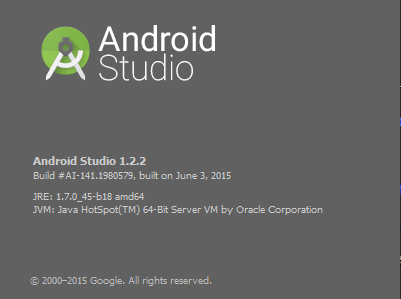
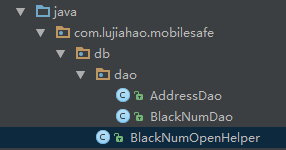
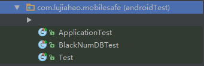
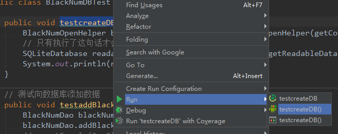
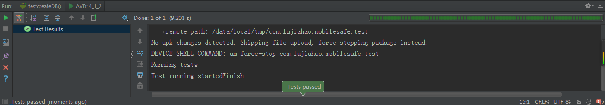
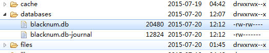

#Android Studio简单的单元测试
2015年7月20日21:53:48

>首先我要声明一点，在做单元测试的时候，测试方法要以`test`开头！！！
>测试方法要以`test`开头！！！
>测试方法要以`test`开头！！！（重要的事情要说三遍）

Android Studio版本：

`这个是普通版本的单元测试，那个高大上的Instrumentation我还没看懂，以后会慢慢补上的`

1. 项目结构

	数据库包的结构：

	

	单元测试包的结构：

	

	>有一点我们需要注意一下，现在的AndroidStudio对单元测试时默认支持的，我们创建项目的时候就会帮助我们创建一个单元测试工程。

2. 项目代码

	>首先是数据库的OpenHelper

		/**
		 * Created by chiahao on 2015/7/20.
		 */
		public class BlackNumOpenHelper extends SQLiteOpenHelper {
		
		    // 我们这里把数据库的名字单独抽取出来方便后面调用
		    public static final String DB_NAME = "info";
		
		    // context:上下文
		    // name：数据库名称
		    // factory：游标工厂  一般为null
		    // version：数据库版本
		    public BlackNumOpenHelper(Context context) {
		        super(context, "blacknum.db", null, 1);
		    }
		
		    /**
		     * 创建数据库的时候调用，一般用于表结构的创建
		     * @param db
		     */
		    @Override
		    public void onCreate(SQLiteDatabase db) {
		        // _id
		        // blackNum：黑名单号码
		        // mode:拦截模式
		        db.execSQL("create table "+DB_NAME+"(_id integer primary key autoincrement,blackNum varchar(20),mode varchar(2))");
		    }
		
		    /**
		     * 数据库更新的时候调用，一般用于更新表结构
		     * @param db
		     * @param oldVersion
		     * @param newVersion
		     */
		    @Override
		    public void onUpgrade(SQLiteDatabase db, int oldVersion, int newVersion) {
		
		    }
		}

	>数据库增删改查工具类

		/**
		 * 黑名单数据库的操作类
		 *      包括：
		 *          创建黑名单数据库
		 *          添加黑名单
		 *          修改黑名单
		 *          查询黑名单
		 *          删除黑名单
		 * Created by chiahao on 2015/7/20.
		 */
		public class BlackNumDao {
		    // 定义拦截模式：拦截电话，拦截短信，拦截电话和短信
		    public static final int TEL = 0;
		    public static final int SMS = 1;
		    public static final int ALL = 2;
		
		    // 抽取一个BlackNumOpenHelper，方便后续操作
		    private BlackNumOpenHelper blackNumOpenHelper;
		
		    public BlackNumDao(Context context) {
		        // 在构造方法中获得BlackNumOpenHelper对象
		        blackNumOpenHelper = new BlackNumOpenHelper(context);
		    }
		
		    /**
		     * 添加黑名单
		     * @param blackNum 黑名单号码
		     * @param mode 拦截模式
		     */
		    public void addBlackNum(String blackNum,int mode){
		        //blackNumOpenHelper.getReadableDatabase();//这个数据库也是可以进行读写操作的，不加锁，线程不安全的，效率，一般读取操作
		        //blackNumOpenHelper.getWritableDatabase();//加锁，线程安全的
		        SQLiteDatabase database = blackNumOpenHelper.getWritableDatabase();
		        ContentValues values = new ContentValues();
		        // 这里的key值必须要和表中字段的名字相同
		        values.put("blackNum",blackNum);
		        values.put("mode",mode);
		        database.insert(BlackNumOpenHelper.DB_NAME, null, values);
		        // 记得关闭数据库，避免内存溢出
		        database.close();
		    }
		
		    /**
		     * 更新黑名单
		     * @param blackNum 黑名单号码
		     * @param mode 拦截模式
		     */
		    public void updateBlackNum(String blackNum,int mode){
		        SQLiteDatabase database = blackNumOpenHelper.getWritableDatabase();
		        ContentValues values = new ContentValues();
		        values.put("mode",mode);
		        // 第二个参数：存放更新字段的数据
		        // 第三个参数：查询的条件
		        database.update(BlackNumOpenHelper.DB_NAME, values, "blackNum = ?", new String[]{blackNum});
		        database.close();
		    }
		
		    /**
		     * 查询黑名单  根据号码查询黑名单的模式
		     * @param blackNum 黑名单号码
		     * @return 拦截模式
		     */
		    public int queryBlackNum(String blackNum){
		        int mode = -1;
		        SQLiteDatabase database = blackNumOpenHelper.getReadableDatabase();
		        // 第二个参数：将要查询的字段
		        // 第三个参数：查询条件
		        // 第四个参数：查询条件的参数
		        Cursor cursor = database.query(BlackNumOpenHelper.DB_NAME, new String[]{"mode"}, "blackNum = ?", new String[]{blackNum}, null, null, null);
		        if (cursor.moveToNext()){
		            mode = cursor.getInt(0);
		        }
		        // 记得关闭游标和数据库，避免内存溢出
		        cursor.close();
		        database.close();
		        return mode;
		    }
		
		    /**
		     * 删除黑名单号码
		     * @param blackNum 黑名单号码
		     */
		    public void deleteBlackNum(String blackNum){
		        SQLiteDatabase database = blackNumOpenHelper.getWritableDatabase();
		        database.delete(BlackNumOpenHelper.DB_NAME,"blackNum = ?",new String[]{blackNum});
		        database.close();
		    }
		}

	>单元测试代码

		/**
		 * 黑名单数据库的单元测试类
		 * 重要的是AndroidStudio的单元测试里面的测试方法必须要以test开头
		 * Created by chiahao on 2015/7/20.
		 */
		public class BlackNumDBTest extends AndroidTestCase {
		
		    public void testcreateDB(){
		        BlackNumOpenHelper blackNumOpenHelper = new BlackNumOpenHelper(getContext());
		        // 只有执行了这句话才会真正创建数据库
		        SQLiteDatabase readableDatabase = blackNumOpenHelper.getReadableDatabase();
		        System.out.println(readableDatabase);
		    }
		
		    // 测试向数据库添加数据
		    public void testaddBlackNum(){
		        BlackNumDao blackNumDao = new BlackNumDao(getContext());
		        blackNumDao.addBlackNum("110", 2);
		        //assertEquals(2, 3);
		    }
		
		    // 测试更新数据
		    public void testupdatBlackNum(){
		        BlackNumDao blackNumDao = new BlackNumDao(getContext());
		        blackNumDao.updateBlackNum("110",0);
		    }
		
		    // 测试查询数据
		    public void testqueryBlackNum(){
		        BlackNumDao blackNumDao = new BlackNumDao(getContext());
		        int mode = blackNumDao.queryBlackNum("110");
		        System.out.println(mode);
		    }
		
		    // 测试删除数据
		    public void testdeleteBlackNum(){
		        BlackNumDao blackNumDao = new BlackNumDao(getContext());
		        blackNumDao.deleteBlackNum("110");
		    }
		}
3. 右键运行单元测试方法

	
4. 单元测试方法执行成功
	
	
5. 数据库创建成功
	
	

这是直接从我的项目中截取的代码，可能写的太过于繁琐了，不过我觉得顺便把数据库复习一下也是不错的嘛。

更加深入了解请参见：

[在Android Studio中进行单元测试和UI测试](http://www.jianshu.com/p/03118c11c199#)