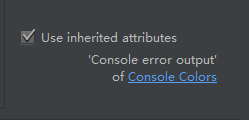
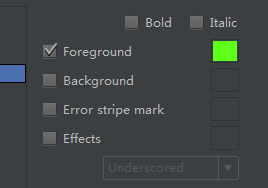
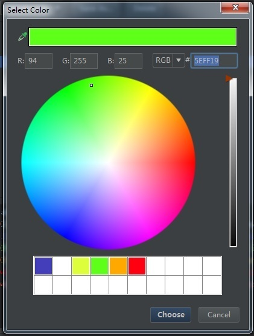
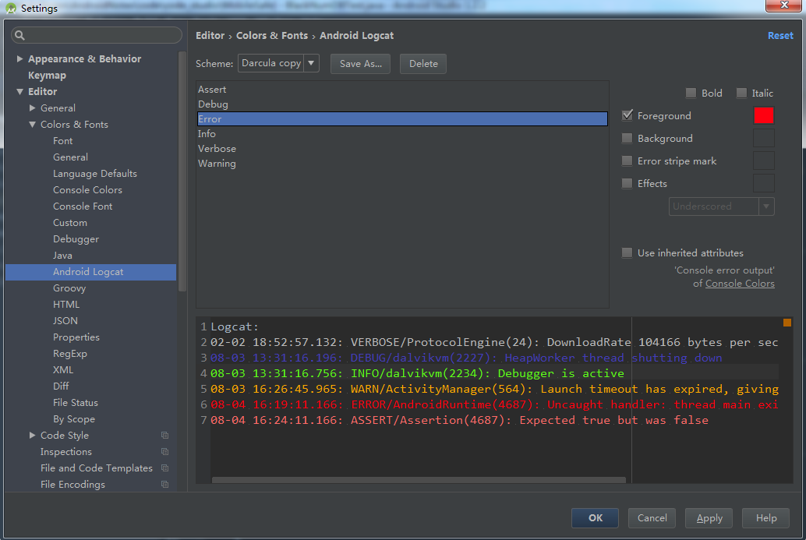

#自定义Android Studio的LogCat颜色
2015年7月21日08:51:58

Android Studio默认的LogCat颜色体验好差！区分各类型的信息简直就是对眼力的挑战，所以为了自己的眼睛，还是自定义一下LogCat提示信息颜色吧。

1. 打开Settings->Editor->Colors & Fonts->Android Logcat（或者搜索logcat）

2. 系统默认选择的是Darcula主题，这里建议点击Save As保存我们自己的主题，名字随便起了。

3. 修改颜色吧
	>注意点：
	>
	>
	>
	>取消勾选这一项（如果选中的话我们是没有办法更改颜色的）

4. 接下来点这个
	
	
5. 选择你喜欢的颜色
	
	
6. 成品
	
	

OK！愉快的LogCat吧！
	