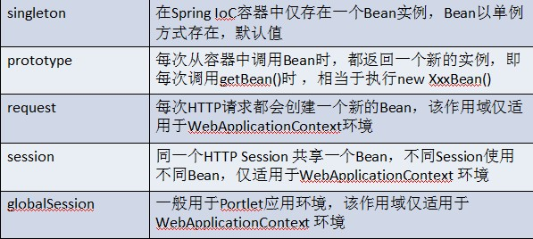

# Spring-Bean
本部分代码详见 [JavaEE/LearnSpring/chapter2.3](https://github.com/chiahaolu/JavaEE)
## Bean的命名
> 每个Bean可以有一个或多个id（或称之为标识符或名字），在这里我们把第一个id称为“标识符"，
> 其余id叫做“别名"；这些id在IoC容器中必须唯一。

- 不指定id，只配置必须的全限定类名，由IoC容器为其生成一个标识，客户端必须通过接口“T getBean(Class<T> requiredType)"获取Bean
```xml
<bean class="cn.javass.spring.chapter2.helloworld.HelloImpl"/>
```    
- 指定id，必须在Ioc容器中唯一
```xml
<bean id="bean" class="cn.javass.spring.chapter2.helloworld.HelloImpl"/>
```
- 指定name，这样name就是“标识符"，必须在Ioc容器中唯一
```xml
<bean name="bean" class="cn.javass.spring.chapter2.helloworld.HelloImpl"/>
```
- 指定id和name，id就是标识符，而name就是别名，必须在Ioc容器中唯一
```xml
<bean id="bean1" name="alias1" class=" cn.javass.spring.chapter2.helloworld.HelloImpl"/>  
<!-- 如果id和name一样，IoC容器能检测到，并消除冲突 -->  
<bean id="bean3" name="bean3" class="cn.javass.spring.chapter2.helloworld.HelloImpl"/> 
```
- 指定多个name，多个name用“，"、“；"、“ "分割，第一个被用作标识符，其他的（alias1、alias2、alias3）是别名，所有标识符也必须在Ioc容器中唯一
```xml
<bean name=" bean1;alias11,alias12;alias13 alias14" class=" cn.javass.spring.chapter2.helloworld.HelloImpl"/>  
<!-- 当指定id时，name指定的标识符全部为别名 -->  
<bean id="bean2" name="alias21;alias22"  
class="cn.javass.spring.chapter2.helloworld.HelloImpl"/> 
```
- 使用<alias>标签指定别名，别名也必须在IoC容器中唯一
```xml
<bean name="bean" class="cn.javass.spring.chapter2.helloworld.HelloImpl"/>  
<alias alias="alias1" name="bean"/>  
<alias alias="alias2" name="bean"/> 
```

## Bean的三种实例化方式
spring提供三种实例化方式：`默认构造`、`静态工厂`、`实例工厂`
- 默认(无参)构造：默认情况，一般常使用。
- 静态工厂、实例工厂：spring与第三方工具或框架整合使用。

### 默认构造
```xml
<!-- 使用默认构造参数 -->
<bean name="bean1" class="com.lujiahao.spring.chapter2.HelloImpl2"></bean>
<!-- 使用有参数构造 -->
<bean name="bean2" class="com.lujiahao.spring.chapter2.HelloImpl2">
    <!-- 指定构造器参数 -->
    <constructor-arg index="0" value="Hello Spring!"></constructor-arg>
</bean>
```
### 静态工厂
配置方法 :
```xml
<bean id="" class="工厂全限定类名" factory-method="静态方法"/>
```
示例代码 :
```Java
public class HelloApiStaticFactory {
    // 工厂方法
    public static HelloApi newInstance(String message){
        // 返回需要的bean实例
        return new HelloImpl2(message);
    }
}
```
```xml
<!--将工厂交于spring，自定义工厂创建对象，由spring管理-->
<bean id="bean3" class="com.lujiahao.spring.chapter2.HelloApiStaticFactory" 
    factory-method="newInstance">
    <constructor-arg index="0" value="Hello Spring via staticFactory!"/>
</bean>
```

### 实例工厂
> 实例工厂中工厂bean的配置其实使用的是默认构造中的无参方式

配置方法 :
```xml
<!-- 1 创建工厂 -->
<bean id="myFactoryId" class="工厂全限定类名"></bean>
<!-- 2 实例工厂创建对象，交予spring管理 
    * factory-bean 确定实例工厂
    * factory-method 确定方法
-->
<bean id="orderServiceId" factory-bean="myFactoryId" factory-method="createService"></bean>
```
示例代码 :
```Java
public class HelloApiInstanceFactory {
    public HelloApi newInstance(String message){
        return new HelloImpl2(message);
    }
}
```
```xml
<!--1.定义实例工厂bean-->
<bean id="beanInstanceFactory" class="com.lujiahao.spring.chapter2.HelloApiInstanceFactory"/>

<!--2.使用实例工厂bean创建需要的bean-->
<bean id="bean4" factory-bean="beanInstanceFactory" factory-method="newInstance">
    <constructor-arg index="0" value="Hello Spring via InstanceFactory!"/>
</bean>
```

## Bean的作用域
作用域：确定spring创建的bean使用范围。<br/>
格式：`<bean id="" class=""  scope="....">`<br/>
取值 :<br/>


常用：singleton 单例（默认值）、prototype 多例<br/>
应用场景：
	
	service和dao 使用默认值即可，singleton，没有成员变量，不会出现线程并发问题。
	struts 请求处理类action，多例（一次请求，一个值栈，一个aciton实例）
	回顾：servlet 单例（tomcat只创建一个实例），多线程。

## Bean的生命周期
bean一共有11个生命周期,有时间详细掌握一下吧!
### 初始化和销毁
格式 : `<bean id="" class="" init-method="初始化方法" destroy-method="销毁方法">`

示例代码 :
```java
public class HelloImpl4 implements HelloApi{
    public void myInit(){
        System.out.println("method myInit exec");
    }
    @Override
    public void sayHello() {
        System.out.println("method sayHello exec");
    }
    public void myDestory(){
        System.out.println("method myDestory exec");
    }
}

<bean id="helloImpl4" class="com.lujiahao.spring.bean.lifecycle.HelloImpl4" init-method="myInit" destroy-method="myDestory"/>

@Test
public void testLifecycle(){
    String xmlPath = "applicationContext-lifecycle.xml";
    ClassPathXmlApplicationContext beanFactory = new ClassPathXmlApplicationContext(xmlPath);
    HelloImpl4 helloImpl4 = (HelloImpl4) beanFactory.getBean("helloImpl4");
    helloImpl4.sayHello();
    beanFactory.close();
}

输出结果 : 
    method myInit exec
    method sayHello exec
    method myDestory exec
```
应用场景 : 不同框架或工具销毁方法名不确定，通过destroy-method 进一步确定。

### 后处理Bean
spring 后处理bean提供一种机制，可以对实例对象进行修改的机制。

步骤 : 
    
    1. 编写实现类：实现接口 BeanPostProcessor
	2. 将实现类配置到spring容器（xml）
		spring容器在创建bean是，都将自动的使用处理bean。
```java
/**
 * postProcessBeforeInitialization 初始化方法之前执行
 * postProcessAfterInitialization 初始化方法之后执行
 * 	参数1 bean，表示spring创建实例对象  <bean class="..."> 由spring new
 * 	参数2 beanName，表示 spring 创建实例名称 <bean id="名称">
 * 如果不进行任何操作，必须将bean进行返回。
 * 应用场景：如果返回的是代理对象，通过getBean获得对象就是代理，aop底层。
 */
public class MyBeanPostProcessor implements BeanPostProcessor {
    @Override
    public Object postProcessBeforeInitialization(Object o, String s) throws BeansException {
        if ("lujiahao".equals(s)) {
            return o;
        }
        System.out.println("postProcessBeforeInitialization exec" + s);
        return o;
    }
    @Override
    public Object postProcessAfterInitialization(Object o, String s) throws BeansException {
        if ("lujiahao".equals(s)) {
            return o;
        }
        System.out.println("postProcessAfterInitialization exec" + s);
        return o;
    }
}

<bean id="helloImpl4" class="com.lujiahao.spring.bean.lifecycle.HelloImpl4" init-method="myInit" destroy-method="myDestory"/>
<bean id="lujiahao" class="com.lujiahao.spring.bean.lifecycle.Lujiahao"/>
<bean class="com.lujiahao.spring.bean.lifecycle.MyBeanPostProcessor"/>

输出结果 : 
    postProcessBeforeInitialization exechelloImpl4
    method myInit exec
    postProcessAfterInitialization exechelloImpl4
    method sayHello exec
    method myDestory exec
注意 : 
    使用对象为xml 所有的bean
    能扩展bean的能力
```
