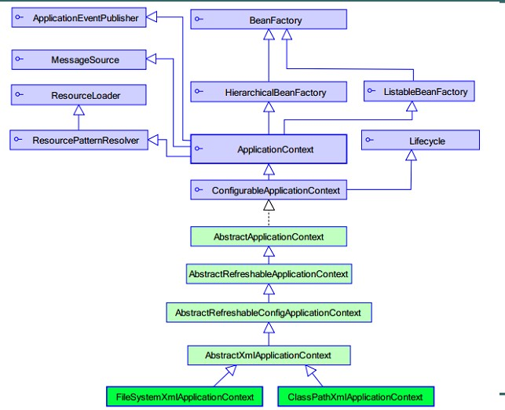

# 依赖注入
DI，依赖注入：spring创建对象A时，将对象A依赖的对象B进行自动注入过程。
BookService ， service依赖 dao，spring将自动创建dao，并通过service提供的setter方法进行设置（注入）
```java
BookService bookService = new BookService();   //IoC
BookDao bookDao = new BookDao();           //IoC
bookService.setBookDao(bookDao);            //DI
```
示例代码 :
通过 setter 进行注入，取代硬编码方式（new BookDao() ）
```java
public class BookDao {
	public void save(){
		System.out.println("save book");
	}
}
public class BookService {
	private BookDao bookDao;
	public void setBookDao(BookDao bookDao){
		this.bookDao = bookDao;
	}
	
	public void addBook(){
		bookDao.save();
	}
}

<!-- 创建dao -->
<bean id="bookDaoId" class="com.itheima.b_di.BookDao"></bean>
<!-- 创建service -->
<bean id="bookServiceId" class="com.itheima.b_di.BookService">
    <!-- <property> 进行依赖注入过程，底层将执行setter方法
        * name 对象的属性， setBookDao -> BookDao -> bookDao
        * ref 其他对象实例引用
     -->
    <property name="bookDao" ref="bookDaoId"></property>
</bean>

@Test
public void test1(){
    String xmlPath = "applicationContext-di.xml";
    BeanFactory beanFactory = new ClassPathXmlApplicationContext(xmlPath);
    BookService bookService = (BookService) beanFactory.getBean("bookService");
    bookService.addBook();
}
```

## API

```
BeanFactory：一个工厂，用于生产任意bean工厂。将spring加载xml时，延迟实例化，第一次调用getBean是才创建。
ApplicationContext ：是BeanFactory的子类，对BeanFactory提供更多api
    例如：国际化处理、事件传递、Bean自动装配、各种不同应用层的Context实现
实现类：
    ClassPathXmlApplicationContext ，用于加载类路径（classpath、src）指定位置的配置文件。
        开发中常见目录：/WEB-INF/classes/... 目录
    FileSystemXmlApplicationContext，用于加载指定路径下的xml位置文件。
        开发中常见目录：/WEB-INF/.... 目录，
        扩展： servletContext.getRealPath("/WEB-INF/...");  --> d:/....
方法
getBean("bean名称")  通过指定的名称获得实例对象，返回Object类型，使用时需要强转
getBean("bean名称",Class) 通过指定的名称获得实例对象，返回Class指定的类型。
```