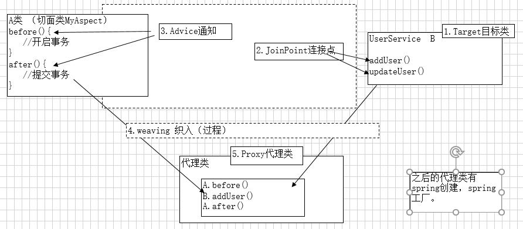

# Spring AOP

## 介绍
<p>在软件业，AOP为Aspect Oriented Programming的缩写，
   意为：面向切面编程，通过预编译方式和运行期动态代理实现程序功能的统一维护的一种技术。
   AOP是OOP的延续，是软件开发中的一个热点，也是Spring框架中的一个重要内容，
   是函数式编程的一种衍生范型。利用AOP可以对业务逻辑的各个部分进行隔离，
   从而使得业务逻辑各部分之间的耦合度降低，提高程序的可重用性，同时提高了开发的效率。</p>

## 应用场景
- 性能监视
- 事务管理
- 安全检查
- 缓存
- 等等

## 实现原理
- 有接口和实现类,使用JDK动态代理
- 只有实现类,没有接口,采用CGLIB字节码增强

## 术语介绍
- Target : 目标类，需要被增强的类。
- JoinPoint：连接点，目标类上需要被增强的方法。（这些方法可以被增强，也可能不增强）
- PointCut：切入点，被增强的连接点。（已经增强了）
 	切入点是连接点一个子集。
- Advice ：增强/通知，增强的方法。
- weaving：织入，将切入点和通知结合，生成代理类 过程。
- Proxy：代理类
- Aspect：切面，切入点和通知结合（切入点 和 通知点 多点形成面）
- 特殊情况：一个切入点 和 一个通知
- Introduction(引介):特殊的通知，可以对类增强，添加方法或字段。（知道）



## SpringAOP手动实现方式
### JDK动态代理(接口+实现类)
#### 1.编写接口
```java
public interface UserService {
    void addUser();
    void delUser();
}
```
#### 2.编写实现类
```java
public class UserServiceImpl implements UserService {
    @Override
    public void addUser() {
        System.out.println("添加用户");
    }

    @Override
    public void delUser() {
        System.out.println("删除用户");
    }
}
```
#### 3.编写切面类
```java
public class MyAspect {
    public void preAspect(){
        System.out.println("********** MyAspect 切面类 preAspect() 执行 **********");
    }

    public void afterAspect(){
        System.out.println("********** MyAspect 切面类 afterAspect() 执行 **********");
    }
}
```
#### 4.编写JDK代理类
```java
public class JDKProxy implements InvocationHandler {
    private Object targetObject;

    private MyAspect myAspect = new MyAspect();

    /**
     * 使用jdk动态代理生成代理类
     */
    public Object newProxy(Object targetObject) {
        this.targetObject = targetObject;
        return Proxy.newProxyInstance(targetObject.getClass().getClassLoader(),
                targetObject.getClass().getInterfaces(), this);
    }

    /**
     * 代理类每一个方法执行时,都将调用处理类的invoke方法
     */
    @Override
    public Object invoke(Object proxy, Method method, Object[] args) throws Throwable {
        // 执行前通知
        myAspect.preAspect();
        // 执行目标类的相应方法
        Object ret = method.invoke(targetObject, args);
        // 执行后通知
        myAspect.afterAspect();
        return ret;
    }
}
```
#### 5.编写测试类
```java
public class TestJDKProxy {
    public static void main(String[] args){
        JDKProxy jdkProxy = new JDKProxy();
        UserService userService = (UserService) jdkProxy.newProxy(new UserServiceImpl());
        userService.addUser();
    }
}
执行结果 : 
    ********** MyAspect 切面类 preAspect() 执行 **********
    添加用户
    ********** MyAspect 切面类 afterAspect() 执行 **********
```
### CGLIB代理(实现类)

## Spring工厂Bean半自动实现方式

## Spring传统AOP开发