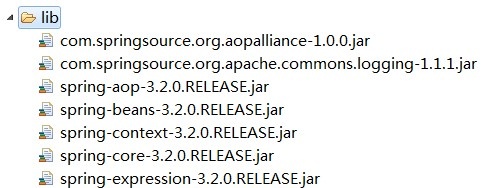

# SpringAOP的三种方式

## 1.SpringAOP手动实现方式
### 1.1 JDK动态代理(接口+实现类)
#### 1.1.1 编写接口
```java
public interface UserService {
    void addUser();
    void delUser();
}
```
#### 1.1.2 编写实现类
```java
public class UserServiceImpl implements UserService {
    @Override
    public void addUser() {
        System.out.println("添加用户");
    }

    @Override
    public void delUser() {
        System.out.println("删除用户");
    }
}
```
#### 1.1.3 编写切面类
```java
public class MyAspect {
    public void preAspect(){
        System.out.println("********** MyAspect 切面类 preAspect() 执行 **********");
    }

    public void afterAspect(){
        System.out.println("********** MyAspect 切面类 afterAspect() 执行 **********");
    }
}
```
#### 1.1.4 编写JDK代理类
```java
public class JDKProxy implements InvocationHandler {
    private Object targetObject;

    private MyAspect myAspect = new MyAspect();

    /**
     * 使用jdk动态代理生成代理类
     */
    public Object newProxy(Object targetObject) {
        this.targetObject = targetObject;
        return Proxy.newProxyInstance(targetObject.getClass().getClassLoader(),
                targetObject.getClass().getInterfaces(), this);
    }

    /**
     * 代理类每一个方法执行时,都将调用处理类的invoke方法
     */
    @Override
    public Object invoke(Object proxy, Method method, Object[] args) throws Throwable {
        // 执行前通知
        myAspect.preAspect();
        // 执行目标类的相应方法
        Object ret = method.invoke(targetObject, args);
        // 执行后通知
        myAspect.afterAspect();
        return ret;
    }
}
```
#### 1.1.5 编写测试类
```java
public class TestJDKProxy {
    public static void main(String[] args){
        JDKProxy jdkProxy = new JDKProxy();
        UserService userService = (UserService) jdkProxy.newProxy(new UserServiceImpl());
        userService.addUser();
    }
}
执行结果 : 
    ********** MyAspect 切面类 preAspect() 执行 **********
    添加用户
    ********** MyAspect 切面类 afterAspect() 执行 **********
```
### 1.2 CGLIB代理(实现类)

#### 1.2.1 编写实现类
```java
public class PersonImpl {
    public void addPerson() {
        System.out.println("添加用户");
    }

    public void delPerson() {
        System.out.println("删除用户");
    }
}
```
#### 1.2.2 编写切面类
```java
public class MyAspect {
    public void preAspect(){
        System.out.println("********** MyAspect 切面类 preAspect() 执行 **********");
    }

    public void afterAspect(){
        System.out.println("********** MyAspect 切面类 afterAspect() 执行 **********");
    }
}
```
#### 1.2.3 编写CGLIB代理类
```java
public class CGLibProxy implements MethodInterceptor {
    // CGLib需要代理的目标对象
    private Object targetObject;

    private MyAspect myAspect = new MyAspect();
    /**
     * 创建代理对象
     */
    public Object createProxyObject(Object obj) {
        this.targetObject = obj;
        Enhancer enhancer = new Enhancer();
        enhancer.setSuperclass(obj.getClass());
        enhancer.setCallback(this);
        Object proxyObj = enhancer.create();
        return proxyObj;
    }

    @Override
    public Object intercept(Object o, Method method, Object[] objects, MethodProxy methodProxy) throws Throwable {
        if ("addPerson".equals(method.getName())) {
            System.out.println("********** 方法过滤 : addPerson方法执行了 **********");
        }
        myAspect.preAspect();
        Object obj = method.invoke(targetObject, objects);
        myAspect.afterAspect();
        return obj;
    }
}
```
#### 1.2.4 编写测试类
```java
public class TestCGLibProxy {
    public static void main(String[] args){
        PersonImpl person = (PersonImpl) new CGLibProxy().createProxyObject(new PersonImpl());
        person.addPerson();
    }
}
执行结果 : 
    ********** 方法过滤 : addPerson方法执行了 **********
    ********** MyAspect 切面类 preAspect() 执行 **********
    添加用户
    ********** MyAspect 切面类 afterAspect() 执行 **********
```
[详细代码](https://github.com/chiahaolu/JavaEE/tree/master/LearnSpring/spring_aop)
## 2.Spring工厂Bean半自动实现方式
### 2.1导入jar包

### 2.2目标类和接口
```java
public class TeacherServiceImpl implements TeacherService {
    @Override
    public void addTeacher() {
        System.out.println("add Teacher exec");
    }

    @Override
    public void delTeacher() {
        System.out.println("del teacher exec");
    }
}
```
### 2.3编写切面类
```java
/**
 * 切面类，用于存放通知，使用的aop联盟规范，必须实现接口，从而确定方法名称（及spring如果执行通知）
 * @author lujiahao
 * @version 1.0
 * @date 2017-06-24 17:51
 */
public class MyAspect implements MethodInterceptor{
    @Override
    public Object invoke(MethodInvocation methodInvocation) throws Throwable {
        System.out.println("********* pre **********");
        //环绕通知，必须手动的执行目标方法
        Object proceed = methodInvocation.proceed();
        System.out.println("********* after **********");
        return proceed;
    }
}
```
### 2.4Spring配置
```xml
<?xml version="1.0" encoding="UTF-8"?>
<beans xmlns="http://www.springframework.org/schema/beans"
       xmlns:xsi="http://www.w3.org/2001/XMLSchema-instance"
       xsi:schemaLocation="http://www.springframework.org/schema/beans http://www.springframework.org/schema/beans/spring-beans.xsd">
    <!--1.创建目标类-->
    <bean id="teacherService" class="com.lujiahao.springbeanfactory.TeacherServiceImpl"></bean>
    <!--2.创建切面类(通知)-->
    <bean id="myAspect" class="com.lujiahao.springbeanfactory.MyAspect"/>
    <!--3.生成代理对象,目的:将目标类与切面类结合
        * ProxyFactoryBean ：生成一个特殊代理bean。
			* interfaces 确定接口，需要使用value
			* target 确定目标类，需要使用ref（对目标类的引用）
			* interceptorNames 确定通知所在类中名称，只需要名称不需要对象。需要使用value
			* optimize 确定是否使用cglib生成代理，true是，默认是false。
    -->
    <bean id="proxyService" class="org.springframework.aop.framework.ProxyFactoryBean">
        <!--3.1确定接口-->
        <property name="interfaces" value="com.lujiahao.springbeanfactory.TeacherService"></property>
        <!--3.2确定目标类-->
        <property name="target" ref="teacherService"/>
        <!--3.3确定通知,使用切面类命名-->
        <property name="interceptorNames" value="myAspect"/>
        <!--3.4强制使用cglib-->
        <property name="optimize" value="true"/>
    </bean>
</beans>
```
### 2.5编写测试类
```java
public class Test {
    public static void main(String[] args){
        String xmlPath = "applicationContext.xml";
        ApplicationContext applicationContext = new ClassPathXmlApplicationContext(xmlPath);
        TeacherService teacherService = (TeacherService) applicationContext.getBean("proxyService");
        teacherService.addTeacher();
    }
}
```
## 3.Spring传统AOP开发